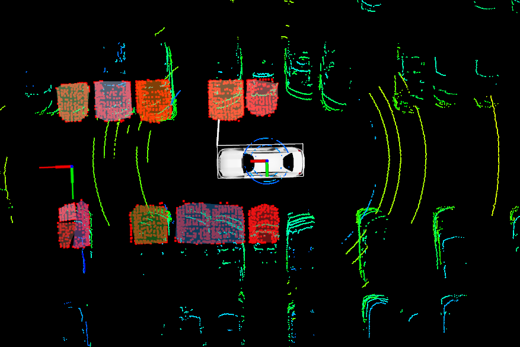

# Lidar Closest Distance Detector(LCDD) ROS package.

This module can calculate the closest distance to the nearest obstacle using Convex Polygon of Lidar Point Cloud. 

It's completely working on ROS kinetic, Ubuntu 16.04.

Youtube is available here. https://youtu.be/TkKlLtUDQE0

## Instruction 

0. install ros-kinetic.
1. clone this repository.
2. move it to your `catkin_ws` or custom workspace.
3. build repository.
 - `catkin_make`
4. update your workspace.
 - `source devel/setup.bash`
5. run lcdd.
 - `roslaunch lcdd_bundle_start bundle_all.launch`
6. It only needs to subscribe `/velodyne_points` topic.
7. enjoy!

## If you have any questions, leave it in Issues!
